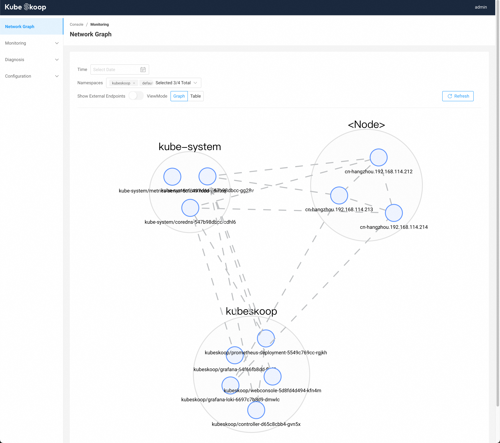
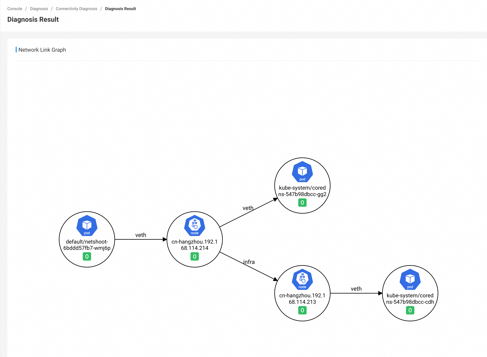
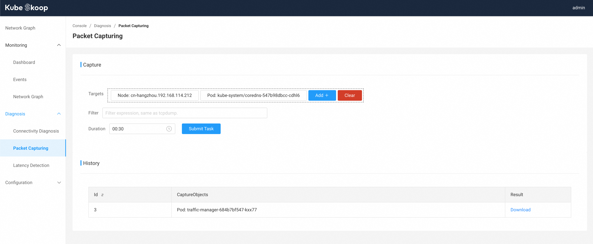
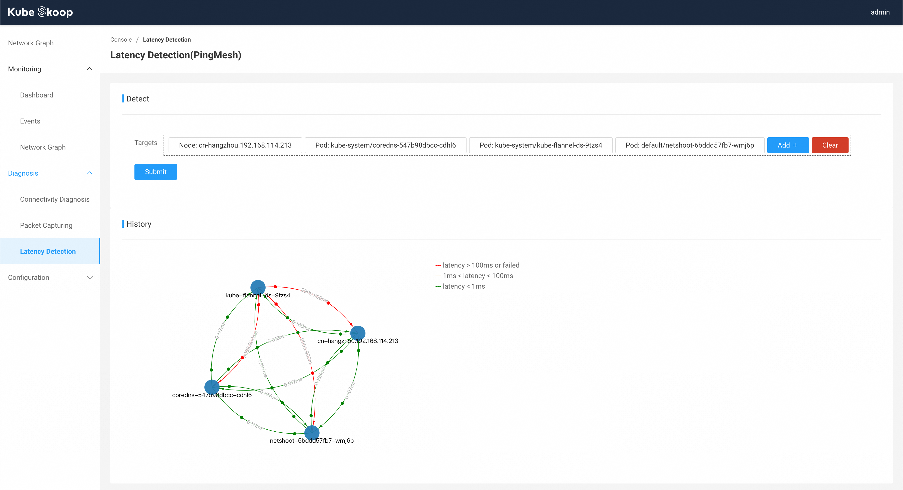
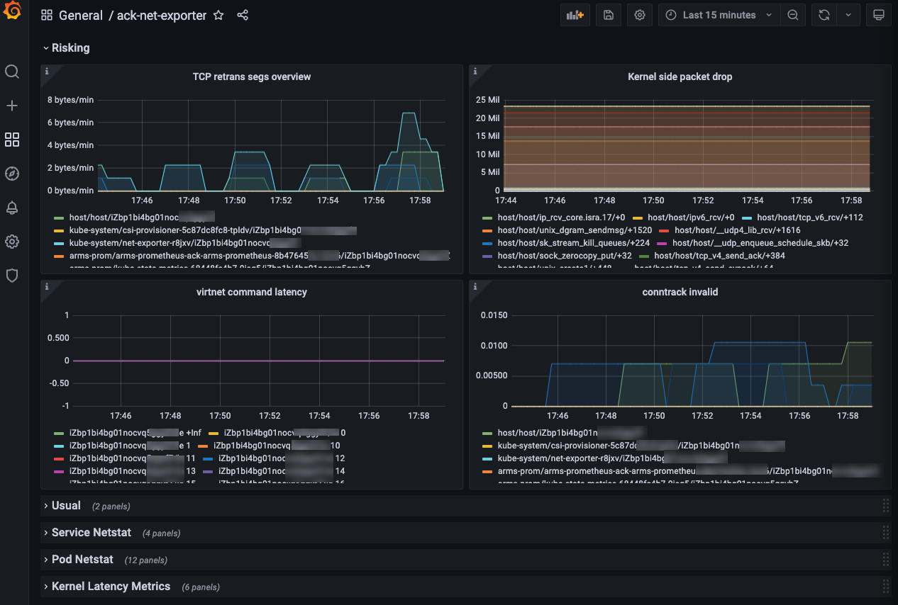
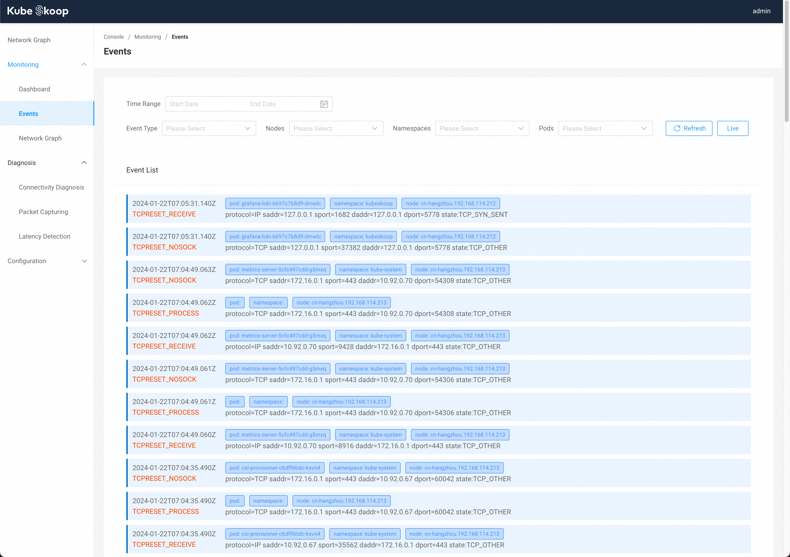
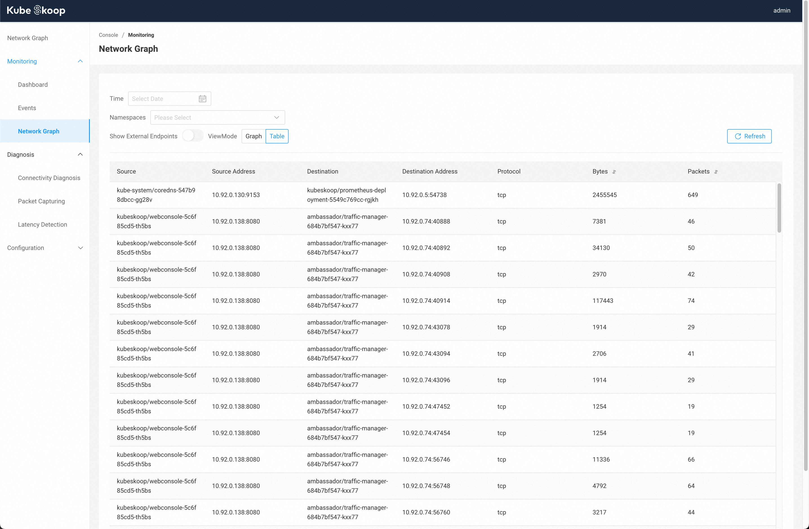

# KubeSkoop


[](https://goreportcard.com/report/github.com/alibaba/kubeskoop)

English | [简体中文](./README_zh.md)

- [Overview](#overview)
- [Quick start](#quick-start)
- [Contributing](#contributing)
- [Contact](#contact)
- [License](#license)

## Overview

KubeSkoop is a kubernetes networking diagnose tool for different CNI plug-ins and IAAS providers.
KubeSkoop automatic construct network traffic graph of Pod in the Kubernetes cluster,
monitoring and analysis of the kernel's critical path by eBPF, to resolve most of Kubernetes cluster network problems.

### Key Features

#### One-Shot Diagnose For Network Broken

- Diagnose in-cluster traffic between Pod,Service,Node and Ingress/Egress Traffic.
- Cover whole linux network stack: Socket,Bridge,Veth,Netfilter,sysctls…
- Support IaaS network probe for cloud providers.

#### In-Depth Kernel Monitor

- eBPF seamless kernel monitor
- CO-RE scripts on series kernel by BTF
- export metrics to standard Prometheus metric API

#### Network Anomaly Event

- support dozens of anomy scenes recognition
- export anomy event to Grafana Loki or Web Console

#### User-friendly Web Console

- Integrating all capabilities of KubeSkoop, provides network diagnosis, event monitoring, packet capturing, latency detection, etc.

## Quick Start

You can view the full documentation from the [KubeSkoop.io](https://kubeskoop.io/).

### Installation

You can quickly deploy KubeSkoop, Prometheus, Grafana and Loki to your cluster via [skoopbundle.yaml](deploy/skoopbundle.yaml).

```bash
kubectl apply -f https://github.com/alibaba/kubeskoop/deploy/skoopbundle.yaml
```

***Note: skoopbundle.yaml starts with the minimum number of replicas and default configurations, which is not suitable for production environments.***

When installation is done, you can acess the KubeSkoop Web Console by service `webconsole`.

```bash
kubectl get svc -n kubeskoop webconsole
```

You may need a `Nodeport` or `LoadBalancer` to acess from outside of the cluster.

Default username is `admin`, and password is `kubeskoop`.



### Network diagnosis

#### Connectivity Diagnosis

Connectivity diagnosis can be submitted through the web console.


Under **Diagnosis - Connectivity Diagnosis**, you can enter the source address, destination address, port, and protocol for diagnosis, and click `Diagnose` to submit the diagnosis. After the diagnosis is complete, you can see the result in the history list.



#### Packet Capturing

Under **Diagnosis - Packet Capturing**，you can perform packet capturing for node/pod in the cluster.



#### Latency Detection

Under **Diagnosis - Latency Detection**，you can detect latencies between multiple nodes and pods.



### Monitor network jitter and bottlenecks

#### Network Performance Dashboard

View the network permance dashboard from **Monitoring - Dashboard**. In the dashboard, you can check the water level of each monitor item corresponding to the time point of the performance problem.  


#### Network Jitter & Anomy Event Analysis

Under **Monitoring - Event**, you can view the anomaly events occurring within the cluster at the current time point. You can also manually select the desired time range, or filter based on event type, node, and information such as the namespace/name of the Pod where the event occurred.

Click `Live` on the right top to view the live event stream according to the current filters.


#### Network Link Graph

Under the homepage or **Monitoring - Network Graph**, you can see the actual network link graph in the cluster, with time and namespaces. You can also switch view mode to `Table` to view each connection.



## Contributing

Feel free to open issues and pull requests. Any feedback is much appreciated!

## Contact

- DingTalk Group ID(26720020148)

## License

Most source code in KubeSkoop which running on userspace are licensed under the [Apache License, Version 2.0](LICENSE.md).  
The BPF code in `/bpf` directory are licensed under the [GPL v2.0](bpf/COPYING) to compat with Linux kernel helper functions.  
