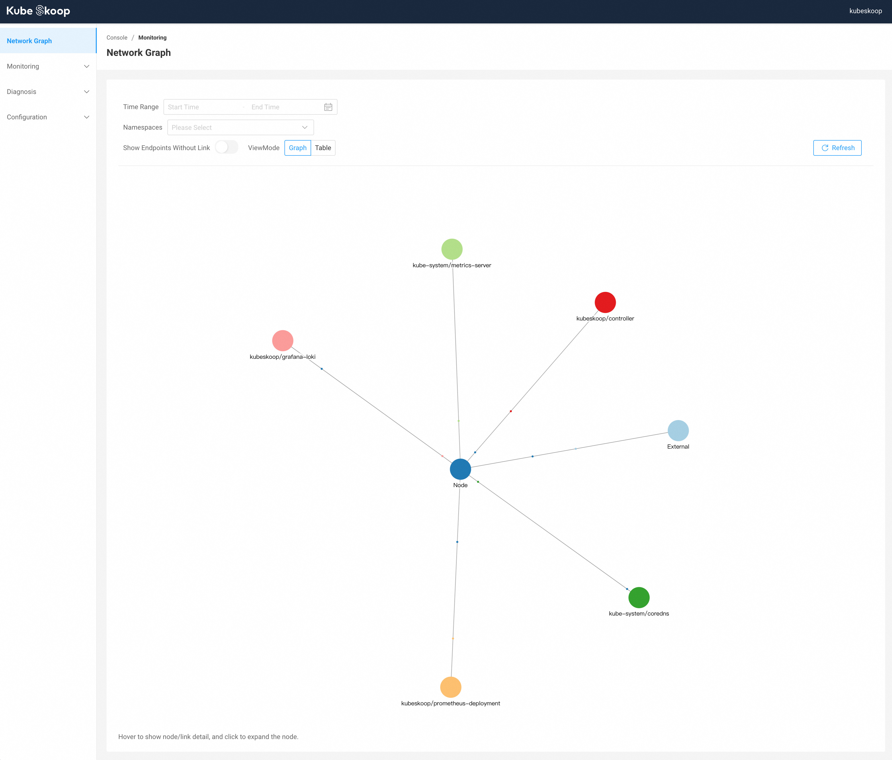
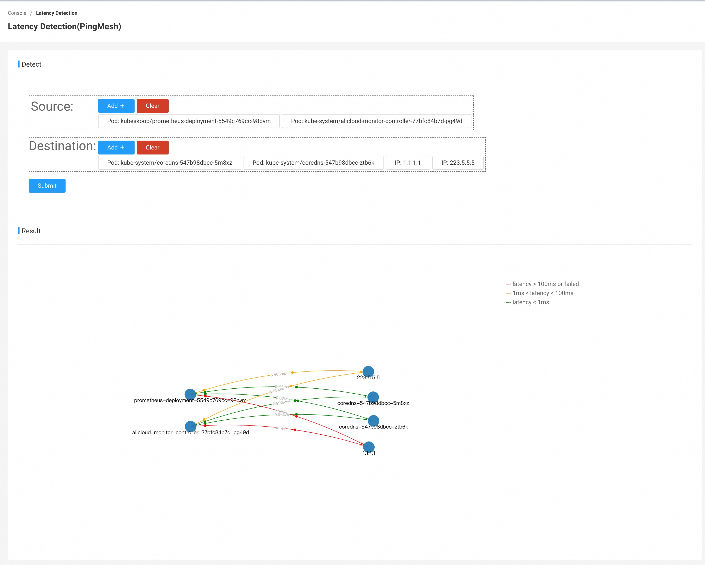

# KubeSkoop


[English](./README.md) | 简体中文

- [总览](#总览)
- [快速开始](#快速开始)
- [贡献说明](#贡献说明)
- [联系](#联系方式)
- [License](#license)

## 总览

KubeSkoop是一个Kubernetes网络诊断工具。针对不同的网络插件和IaaS提供商自动构建Kubernetes集群中Pod的网络访问图，结合eBPF对内核关键路径的深度监控和分析，来分析常见的Kubernetes集群网络问题。显著地简化了Kubernetes网络问题的诊断难度。

### 关键特性

#### 一键诊断网络链路

- 诊断kubernetes集群中各种网络访问方式和链路：Pod,Service,Node以及Ingress/Egress Traffic.

- 覆盖完整的Linux协议栈的配置错误场景: Socket,Bridge,Veth,Netfilter,sysctls…

- 支持诊断多种云供应商的IaaS层网络错误配置

#### 深度网络监控

- 通过eBPF实现无侵入的Kernel Monitor

- 通过BTF在各种版本的Kernel上直接运行

- 通过标准的Prometheus接口暴露深度监控Metrics

#### 网络异常事件识别

- 数十种网络异常场景的自动分析识别
- 通过Web Console或Grafana Loki展示网络异常事件

#### 用户友好的Web控制台

- 集成KubeSkoop所有能力，提供网络诊断、异常事件监控、抓包、延迟探测等功能。

## 快速开始

完整的文档可以直接访问[KubeSkoop.io](https://kubeskoop.io/) 。

### 安装

你可以通过[skoopbundle.yaml](deploy/skoopbundle.yaml)文件快速部署KubeSkoop、Prometheus、Grafana和Loki至你的集群。

```bash
kubectl apply -f https://raw.githubusercontent.com/alibaba/kubeskoop/main/deploy/skoopbundle.yaml
```

***备注: skoopbundle.yaml以最小副本和默认配置启动，不适用于生产环境***

在安装完成并启动后，你可以通过`webconsole`服务来访问KubeSkoop Web控制台。

```bash
kubectl get svc -n kubeskoop webconsole
```

你可能需要使用`NodePort` 或`LoadBalancer`类型的服务从集群外访问。

控制台的默认用户为`admin`，密码为`kubeskoop`。



### 诊断网络问题

#### 网络连通性诊断

可以通过Web控制台对集群内网络发起连通性诊断。


在Diagnosis - Connectivity Diagnosis下输入诊断的源地址、目的地址、端口和协议，点击`Diagnose` 发起诊断。诊断完成后，可以在列表中看到诊断结果。


#### 抓包

你可以在Diagnosis - Packet Capturing中进行集群内Node/Pod的抓包操作。


#### 延迟探测

在Diagnosis - Latency Detection中，对集群内多个Node/Pod之间的网络延迟进行探测。



### 监控集群网络

#### 查看网络抖动和性能大盘

在Monitoring - Dashboard中，可以查看当前集群内网络大盘，从大盘中可查询对应性能问题时间点的各深度指标的水位情况。


#### 查看网络抖动事件

在Monitoring - Event下，可以看到当前时间点集群内产生的异常事件。你也可以手动选择需要的时间范围，或者根据事件类型、节点、事件产生的Pod命名空间/名称等信息进行筛选。

点击右上角的`Live`，可以实时根据当前筛选条件，实时监控集群内事件。


#### 网络链路图

在主页或Monitoring - Network Graph中，可以看到当前集群内的网络实际链路图，并通过时间、命名空间进行筛选。你也可以将模式改为`Table`按条查看连接信息。


## 贡献说明

欢迎提交issue和PR来共建此项目。

## 联系方式

- 钉钉群号 (26720020148)

## License

KubeSkoop的多数用户态代码使用[Apache License, Version 2.0](LICENSE.md)。 `/bpf`目录下的BPF代码使用[GPL v2.0](bpf/COPYING)。

## 安全

如果您发现了代码中的安全漏洞，请联系[kubernetes-security@service.aliyun.com](mailto:kubernetes-security@service.aliyun.com)。详见 [SECURITY.md](SECURITY.md)
